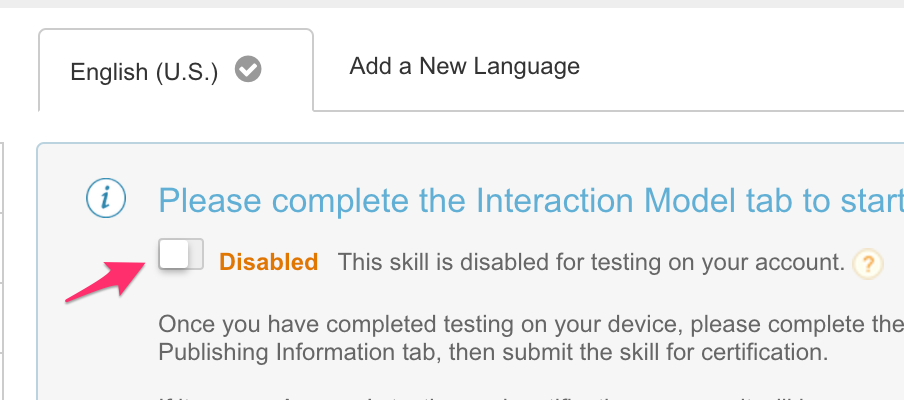
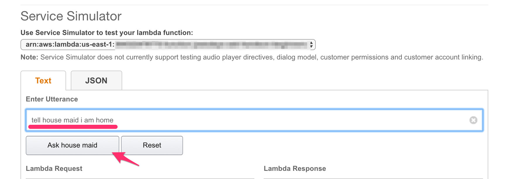
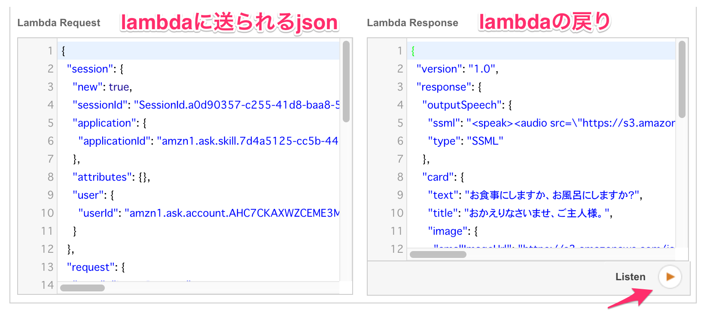

# ASK CLIを試す

## 事前準備

- Amazon Developer Accountの作成
  - https://developer.amazon.com/
- cliのインストール
  - https://developer.amazon.com/public/solutions/alexa/alexa-skills-kit/docs/quick-start-alexa-skills-kit-command-line-interface#step-2-install-and-initialize-ask-cli

---

# ハンズオン

- regionはすべて、 `us-east-1` を利用する

## 事前確認

- Alexa Skillsの画面が見られるか
  - https://developer.amazon.com/edw/home.html#/skills
- ask cliのプロファイルが作られているか
  - `ask init -l`
- ハンズオン用のサンプルソースを含んでいるgitリポジトリをcloneする

以降の作業はcloneしたリポジトリのディレクトリに入って行う

## S3バケットの準備

- バケット作成
- audio/の中身をすべて作成したバケットにアップロード
- オブジェクトのACLはすべて `public-read`

## roleの作成

Lambda用のRoleを作成

```
{
    "Version": "2012-10-17",
    "Statement": [
        {
            "Effect": "Allow",
            "Action": [
                "logs:CreateLogGroup",
                "logs:CreateLogStream",
                "logs:PutLogEvents"
            ],
            "Resource": "arn:aws:logs:*:*:*"
        }
    ]
}
```

## Lambdaの作成

lambdaの作成は以下の内容で。
指定がない項目についてはデフォルトのまま。

|項目|値など|
|----|----|
|function-name|house-maid|
|runtime|python2.7|
|role|上記で作成したRole|
|handler|lambda_function.lambda_handler|
|description|handsonっぽい內容|
|region|us-east-1|

環境変数

- MEDIA_BUCKET
  - 作ったS3のバケット名


作成したLambdaのARNを控えておく

## Skillの登録

### クレデンシャルの登録

initコマンドで登録する。

```
$ ask init -p <profile名>
```

途中で聞かれるので、既存のAWSプロファイルのヒモ付も行います。

### ask用の環境変数設定

```
export ASK_DEFAULT_DEVICE_LOCALE=en-US
export ASK_DEFAULT_PROFILE=<ask initで指定したプロファイル名>
```

### Skillの作成

この例では、ask-cliでlambdaを管理する方法は使いません。

`ask/skill.json` の中の `apis.custom.endpoint.uri` と `apis.custom.regions.NA.uri` に、先ほど作成したLambdaのARNを指定する。

```
$ ask api create-skill -f ask/skill.json

Skill created successfully.
Skill ID: ${ASK_SKILL_ID}
```

Skill IDを環境変数に追加

```
export ASK_SKILL_ID=<表示されたSkill ID>
```

この時点ではskillの基本情報が作られているだけ。
確認は以下のコマンドで行う。

```
$ ask api get-skill -s ${ASK_SKILL_ID}


{
  "skillManifest": {
    "publishingInformation": {
      "locales": {
        "en-US": {
          "name": "house maid"
        }
      },
      "isAvailableWorldwide": true,
      "distributionCountries": []
    },
    "apis": {
      "custom": {
        "endpoint": {
          "uri": "arn:aws:lambda:us-east-1:1111111111:function:ask-cli-test"
        },
        "regions": {
          "NA": {
            "endpoint": {
              "uri": "arn:aws:lambda:us-east-1:1111111111:function:ask-cli-test"
            }
          }
        }
      }
    },
    "manifestVersion": "1.0"
  }
}
```

### modelの作成 1

このSkillは、 `I am home` と話しかけると、メイドが お風呂にするか食事にするかを話しかけてきます。
modelの作成では、このような発話とskill内の機能の呼び出しを関連付ける情報を登録します。

```
$ ask api update-model -s ${ASK_SKILL_ID} -l ${ASK_DEFAULT_DEVICE_LOCALE} -f ask/model-1.json

Model for en-US submitted.
Please run the following command to track the model build status:
    ask api get-model-status -s ${ASK_SKILL_ID} -l en-US
```

modelのビルド状況を確認

```
$ ask api get-model-status -s ${ASK_SKILL_ID} -l ${ASK_DEFAULT_DEVICE_LOCALE}

Model build status: IN_PROGRESS
```

完了すると `Model build status: SUCCESS` となる

### Skillを実行する

#### skillを有効にする

Skillを実行するには、有効にする必要があります。

https://developer.amazon.com/edw/home.html#/skills

Skillの一覧から、 `house maid` のskillを選択します。

左側のメニューで `test` を選択


disabledになっているのをenabledに変更



#### skillをシミュレート

```
$ ask api simulate-skill -s ${ASK_SKILL_ID} -l ${ASK_DEFAULT_DEVICE_LOCALE} -t "ask house maid"

{
  "id": "085516ce-0201",
  "status": "IN_PROGRESS",
  "result": null
}
```

実行結果を取得

```
$ ask api get-simulation -s ${ASK_SKILL_ID} -i 085516ce-0201
```


```
{
  "status": "SUCCESSFUL",
  "result": {
    "skillExecutionInfo": {
      "invocationRequest": {
        "endpoint": "arn:aws:lambda:us-east-1:99999999999:function:s",
        "body": {
          "version": "1.0",
          "session": {
            "new": true,
            "sessionId": "5c98f208-9b6c-11e7-8dab-d77d8717ffdb",
            "application": {
              "applicationId": "${ASK_SKILL_ID}67-12345"
            },
            "attributes": {},
            "user": {
              "userId": "amzn1.ask.account.zzzzzzzzzzzz"
            }
          },
          "context": {
            "System": {
              "application": {
                "applicationId": "${ASK_SKILL_ID}67-12345"
              },
              "user": {
                "userId": "amzn1.ask.account.zzzzzzzzzzzz"
              }
            }
          },
          "request": {
            "type": "LaunchRequest",
            "requestId": "5c98f208-9b6c-11e7-8dab-d77d8717ffdb",
            "timestamp": "2017-09-17T05:52:17Z",
            "locale": "en-US"
          }
        }
      },
      "invocationResponse": {
        "body": {
          "version": "1.0",
          "response": {
            "outputSpeech": {
              "ssml": "<speak><audio src=\"https://s3.amazonaws.com/help.mp3\"></audio></speak>",
              "type": "SSML"
            },
            "shouldEndSession": true,
            "card": {
              "content": "私にお手伝いできることがあれば言ってくださいね。"
              "type": "Simple",
              "title": "ご主人様、こんにちわ。"
            }
          }
        }
      },
      "metrics": {
        "skillExecutionTimeInMilliseconds": 51
      }
    },
    "error": null
  }
}
```

`result.skillExecutionInfo.invocationRequest.body` の中身がAlexaからLambdaに送られたJSONデータ。

`result.skillExecutionInfo.invocationResponse.body` が、LambdaがAlexaに返したJSONデータ。

発話に対して、返事をしてくれる部分まで完成しました。

### modelの作成 2

ここでは、 `お風呂にする` 、 `食事にする` といった発話に対して、skillの適切な処理を呼び出し、返事をもらうためのModelを追加します。

```
$ ask api update-model -s ${ASK_SKILL_ID} -l ${ASK_DEFAULT_DEVICE_LOCALE} -f ask/model-2.json

Model for en-US submitted.
Please run the following command to track the model build status:
    ask api get-model-status -s ${ASK_SKILL_ID} -l en-US
```

進行状況の確認

```
$ ask api get-model-status -s ${ASK_SKILL_ID} -l ${ASK_DEFAULT_DEVICE_LOCALE}

Model build status: SUCCESS
```

動作確認

```
$ ask api simulate-skill -s ${ASK_SKILL_ID} -l ${ASK_DEFAULT_DEVICE_LOCALE} -t "ask house maid i am home"
{
  "id": "e9af9bd3-e426-4a77-882a-fc90a3eca54e",
  "status": "IN_PROGRESS",
  "result": null
}
```


```
$ ask api get-simulation -s ${ASK_SKILL_ID} -i e9af9bd3-e426-4a77-882a-fc90a3eca54e

{
  "status": "SUCCESSFUL",
  "result": {
    "skillExecutionInfo": {
      "invocationRequest": {
        "endpoint": "arn:aws:lambda:us-east-1:99999999999:function:s",
        "body": {
          "version": "1.0",
          "session": {
            "new": true,
            "sessionId": "9f6781e4-9b71-11e7-9568-29e824cb9c4e",
            "application": {
              "applicationId": "${ASK_SKILL_ID}"
            },
            "attributes": {},
            "user": {
              "userId": "amzn1.ask.account.zzzzzzzzzzzz"
            }
          },
          "context": {
            "System": {
              "application": {
                "applicationId": "${ASK_SKILL_ID}"
              },
              "user": {
                "userId": "amzn1.ask.account.xxxxxxxxxx"
              }
            }
          },
          "request": {
            "type": "IntentRequest",
            "requestId": "9f6781e4-9b71-11e7-9568-29e824cb9c4e",
            "timestamp": "2017-09-17T06:29:57Z",
            "locale": "en-US",
            "intent": {
              "name": "AskIntent"
            }
          }
        }
      },
      "invocationResponse": {
        "body": {
          "version": "1.0",
          "response": {
            "outputSpeech": {
              "ssml": "<speak><audio src=\"https://s3.amazonaws.com/hello.mp3\"></audio><audio src=\"https://s3.amazonaws.com/question.mp3\"></audio></speak>",
              "type": "SSML"
            },
            "shouldEndSession": false,
            "card": {
              "content": "お食事にしますか、お風呂にしますか？",
              "type": "Simple",
              "title": "おかえりなさいませ、ご主人様。"
            }
          }
        }
      },
      "metrics": {
        "skillExecutionTimeInMilliseconds": 50
      }
    },
    "error": null
  }
}
```

お風呂にする

```
$ ask api simulate-skill -s ${ASK_SKILL_ID} -l ${ASK_DEFAULT_DEVICE_LOCALE} -t "tell house maid take a bath"

{
  "id": "e8e992d6-9f31-4cd4-8691-746a4a3d4e8c",
  "status": "IN_PROGRESS",
  "result": null
}
```

結果の確認

```
$ ask api get-simulation -s ${ASK_SKILL_ID} -i e8e992d6-9f31-4cd4-8691-746a4a3d4e8c

{
  "status": "SUCCESSFUL",
  "result": {
    "skillExecutionInfo": {
      "invocationRequest": {
        "endpoint": "arn:aws:lambda:us-east-1:99999999999:function:s",
        "body": {
          "version": "1.0",
          "session": {
            "new": true,
            "sessionId": "09289197-9b72-11e7-ab1d-054a252fed3d",
            "application": {
              "applicationId": "${ASK_SKILL_ID}"
            },
            "attributes": {},
            "user": {
              "userId": "amzn1.ask.account.zzzzzzzzzzz"
            }
          },
          "context": {
            "System": {
              "application": {
                "applicationId": "${ASK_SKILL_ID}"
              },
              "user": {
                "userId": "amzn1.ask.account.xxxxxxxxxx"
              }
            }
          },
          "request": {
            "type": "IntentRequest",
            "requestId": "09289197-9b72-11e7-ab1d-054a252fed3d",
            "timestamp": "2017-09-17T06:32:55Z",
            "locale": "en-US",
            "intent": {
              "name": "BathIntent"
            }
          }
        }
      },
      "invocationResponse": {
        "body": {
          "version": "1.0",
          "response": {
            "outputSpeech": {
              "ssml": "<speak><audio src=\"https://s3.amazonaws.com/bath.mp3\"></audio><audio src=\"https://s3.amazonaws.com/suffix.mp3\"></audio></speak>",
              "type": "SSML"
            },
            "shouldEndSession": true,
            "card": {
              "content": "すぐ用意しますので、くつろいでおまちになってくださいね。",
              "type": "Simple",
              "title": "お風呂ですね。"
            }
          }
        }
      },
      "metrics": {
        "skillExecutionTimeInMilliseconds": 39
      }
    },
    "error": null
  }
}
```

## 実際の画面でも動作確認

### テストコンソール

`skillを有効にする` で開いた画面を再度開き、 `Service Simulator` のtextに発話內容を入力します。

`tell house maid i am home`



結果が表示されるので、右下の再生ボタンをクリックすると、実際に返事を喋ってくれます。


